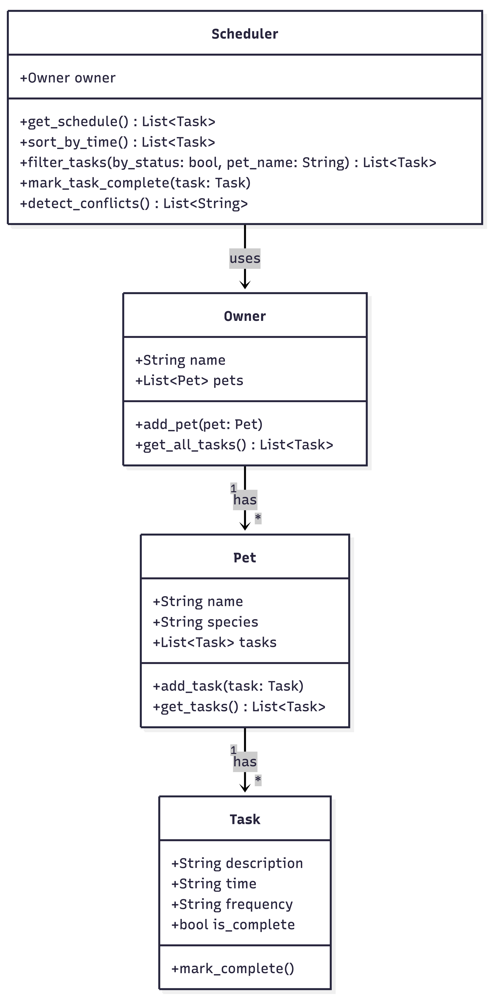
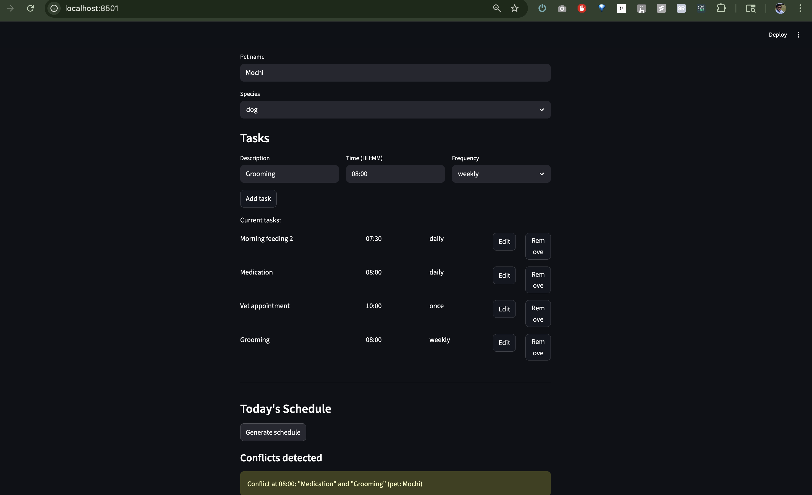

# PawPal+

A smart pet care scheduling assistant built with Python and Streamlit.
PawPal+ helps pet owners plan daily care tasks for their pets — sorting by time, detecting scheduling conflicts, and managing recurring activities.

---

## Features

- **Add, edit, and remove tasks** — each task has a description, time (HH:MM), and frequency (daily / weekly / once)
- **Sort by time** — the schedule always displays tasks in chronological order
- **Conflict detection** — warns when two tasks are scheduled at the same time
- **Recurring task support** — completing a daily or weekly task automatically creates the next occurrence
- **Input validation** — blank fields and invalid time formats are caught before they reach the scheduler
- **Clean OOP backend** — `Owner`, `Pet`, `Task`, and `Scheduler` classes in `pawpal_system.py`

---

## System Design (UML)



The system follows an `Owner → Pet → Task` hierarchy.
`Scheduler` holds a reference to `Owner` and operates across all pets and tasks.

---

## Project Structure

```
pawpal/
├── app.py                  # Streamlit UI
├── pawpal_system.py        # Core OOP model (Owner, Pet, Task, Scheduler)
├── scheduler.py            # Original greedy scheduler (kept for reference)
├── main.py                 # CLI demo script — validates the object model
├── test_pawpal_system.py   # Tests for pawpal_system.py (17 tests)
├── test_scheduler.py       # Tests for scheduler.py (13 tests)
├── uml_final.png           # Final UML class diagram
├── reflection.md           # Project reflection
└── requirements.txt
```

---

## Setup

```bash
python -m venv .venv
source .venv/bin/activate       # Windows: .venv\Scripts\activate
pip install -r requirements.txt
```

---

## Run the App

```bash
streamlit run app.py
```

Opens at `http://localhost:8501`.

---

## Run the Tests

```bash
python -m pytest
```

Runs all 30 tests across both test files. Use `-v` for per-test output:

```bash
python -m pytest -v
```

---

## Run the CLI Demo

```bash
python main.py
```

Creates an `Owner` with two `Pet`s and several `Task`s, then prints a summary — useful for verifying the object model without the UI.

---

## App Demo



The schedule shows tasks sorted by time. A conflict warning appears when two tasks share the same time slot.
